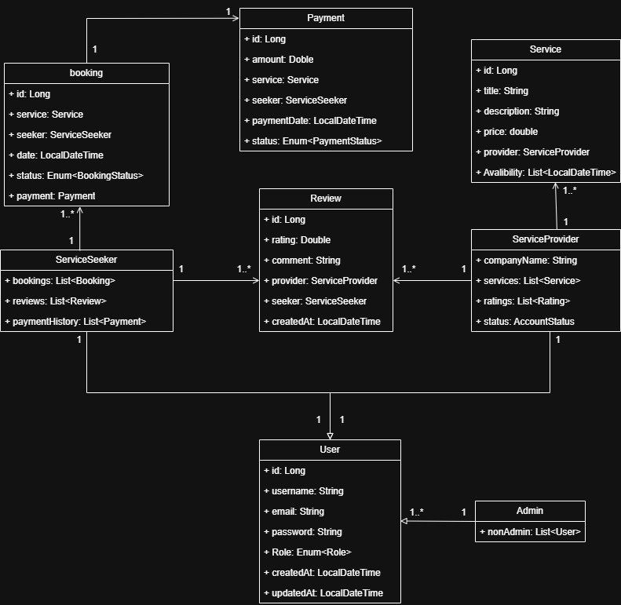

# WorkBridge

**WorkBridge** is an app designed to seamlessly connect service-based entrepreneurs with service seekers. It provides an easy-to-use platform for both parties to conduct business and make secure transactions.

---

## Overview

---

### Purpose

WorkBridge serves as a digital solution for connecting service seekers with service providers. The app simplifies the process of booking services and managing transactions, enabling secure payments directly within the platform.

### Core Functionalities

- **For Service Providers:**
  - List your services for visibility.
  - Manage service offerings.
  
- **For Service Seekers:**
  - Book services from listed providers.
  - Cancel bookings if needed.
  - Rate and review service providers.
  - Chat with service providers for additional details.

- **For Admins:**
  - Enable or disable user accounts.
  - Monitor activity history for both service providers and seekers.
  - Access detailed breakdowns of app revenue.

---

### Functional Requirements

1. **User Accounts**:
   - Service seekers and service providers should be able to register, log in, and manage profiles.
   - Admins should be able to manage accounts, including disabling accounts as necessary.

2. **Service Listings**:
   - Service providers should be able to list services, including descriptions, prices, and availability.

3. **Booking & Cancellation**:
   - Service seekers should be able to book and cancel services seamlessly.

4. **Ratings & Reviews**:
   - Users should be able to leave ratings and reviews for service providers based on their experience.

5. **Communication**:
   - Service seekers and providers should be able to chat for clarification before finalizing bookings.

6. **Payments**:
   - The app should support secure in-app payments for services.

7. **Admin Management**:
   - Admins can manage users, track activities, and view revenue reports.

---

## Setup Instructions

---

### 1. Create `.env` File
At the root of the project, create a `.env` file with the following content:

```env
DB_URL=jdbc:postgresql://workbridge-db:5432/workbridge_db
DB_USERNAME=your_username
DB_PASSWORD=your_password
```

---

### 2. Build Docker Containers

From the root directory, build the Docker containers:

```bash
docker compose build
```

---

### 3. Start the App in Detached Mode

To start the app in the background:

```bash
docker compose up -d
```

---

## Diagrams

---

### Class Diagram



---

