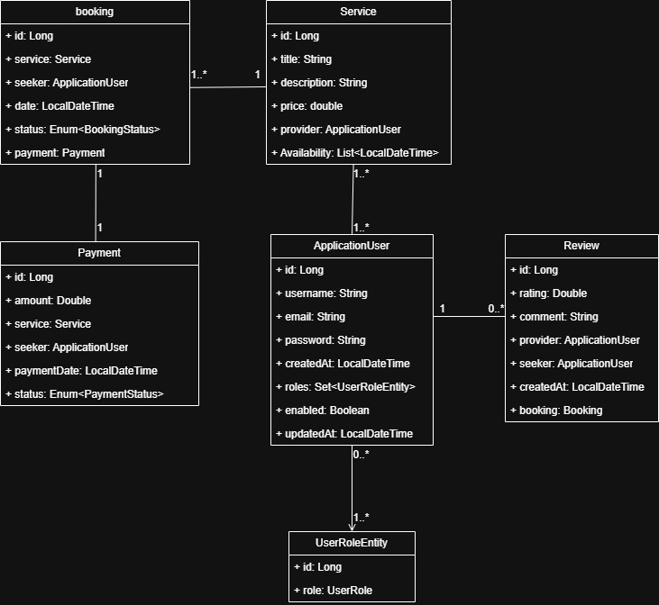

# **WorkBridge**

**WorkBridge** is an application designed to seamlessly connect service-based entrepreneurs with service seekers. It provides an intuitive platform for both parties to conduct business and complete secure transactions.

---

## **Overview**

### **Purpose**

**WorkBridge** serves as a digital marketplace connecting service seekers with service providers. The platform simplifies the process of booking services, managing transactions, and enabling secure in-app payments.

### **Core Functionalities**

#### **For Service Providers:**
- List services for visibility.
- Manage service offerings (edit, remove, etc.).

#### **For Service Seekers:**
- Book services from listed providers.
- Cancel bookings if needed.
- Rate and review service providers.
- Chat with service providers for additional details.

#### **For Admins:**
- Enable or disable user accounts.
- Monitor activity history for both service providers and seekers.
- Access detailed breakdowns of app revenue.

---

## **Functional Requirements**

### **1. User Accounts:**
- Service seekers and providers can register, log in, and manage profiles.
- Admins can manage user accounts, including disabling accounts when necessary.

### **2. Service Listings:**
- Service providers can list services, including descriptions, prices, and availability.

### **3. Booking & Cancellation:**
- Service seekers can seamlessly book and cancel services.

### **4. Ratings & Reviews:**
- Users can leave ratings and reviews based on their experiences with service providers.

### **5. Communication:**
- Service seekers and providers can chat for clarification before finalizing bookings.

### **6. Payments:**
- The app supports secure in-app payments for services.

### **7. Admin Management:**
- Admins can manage users, track activities, and view revenue reports.

---

## **Setup Instructions**

### **1. Create `.env` Files**

At the root of the project, create a `.env` file with the following content:

```env
DB_URL=jdbc:postgresql://workbridge-db:5432/workbridge_db
DB_USERNAME=your_username
DB_PASSWORD=your_password
```

Additionally, create a `.env` file inside the backend directory for local testing. Since this environment does not have access to the Docker network, `localhost` should be used instead:

```env
DB_URL=jdbc:postgresql://localhost:5432/workbridge_db
DB_USERNAME=your_username
DB_PASSWORD=your_password
```

In the future, we may integrate test execution into the Docker Compose setup.

---

### **2. Build Docker Containers**

From the root directory, build the Docker containers by running:

```bash
docker compose build
```

---

### **3. Start the App in Detached Mode**

To start the app in the background, use:

```bash
docker compose up -d
```

---

### **4. Running Tests**

To run tests, navigate to the backend directory and execute the following command:

```bash
mvn test
```

This will spin up a temporary database for test execution. However, an active database container must be running and accepting connections before executing the test command. Ensure the database container is manually started before proceeding.

---

## **Diagrams**

### **Class Diagram**


